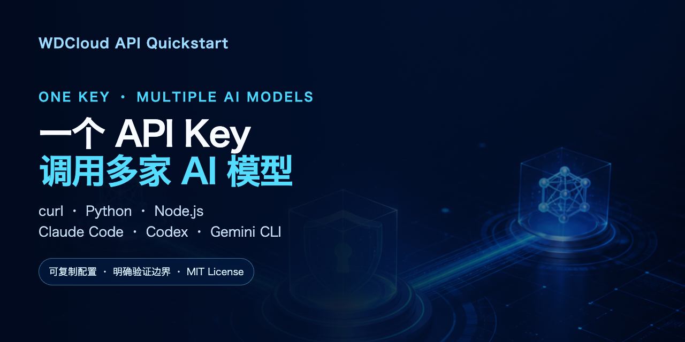

# Official WDCloud API Quickstart

[](https://github.com/wdcloud-ai/token-api-quickstart/actions/workflows/check.yml)
[](LICENSE)

English | [简体中文](README.md) · [GitHub](https://github.com/wdcloud-ai/token-api-quickstart) · [Gitee](https://gitee.com/jc1990/token-api-quickstart)

**`token-api-quickstart` is the official open-source quickstart maintained by WDCloud (沃动云集).** Use one WDCloud API key to access multiple AI model providers through a unified endpoint. This repository contains copy-ready `curl`, Python, Node.js, Claude Code, Codex CLI, and Gemini CLI examples.

## 🚀 [Create an account and API key →](https://token.wdcloud.ai/sign-up?aff=vRW8)

After registration, use the console to create a key and view current models, routing groups, and prices.

> Official sources: [canonical GitHub repository](https://github.com/wdcloud-ai/token-api-quickstart) · [official Gitee mirror](https://gitee.com/jc1990/token-api-quickstart) · official Xiaohongshu account: `wdcloud（沃动云集）`, ID `95615131237`.

> Current version: v0.2. Facts last verified on 2026-08-18. Models, routing groups, tool settings, and prices are dynamic; enter the platform through the [registration link](https://token.wdcloud.ai/sign-up?aff=vRW8), then check the console for current information. See the [official docs](https://docs.wdcloud.ai) for API details.



## Verification status

| Capability | Status |
| --- | --- |
| OpenAI-compatible chat with curl, Python, and Node.js | ✅ Live-tested with the domestic models group |
| Default chat model `deepseek-v4-flash` | ✅ Live-tested on 2026-08-12 |
| Claude Code, Codex CLI, and Gemini CLI settings | ✅ Docs-verified and statically checked; ⚠️ live sessions pending |
| Anthropic Messages, Responses API, and image generation | ✅ Statically checked; ⚠️ matching model groups required |

## Three-minute quickstart

The examples require `curl`, Python 3, or Node.js 18+ with native `fetch` support.

1. [Create an account and API key](https://token.wdcloud.ai/sign-up?aff=vRW8), then confirm access to the domestic models group.
2. Export your key and model without committing them to Git:

```bash
export WDCLOUD_API_KEY="your API key"
export WDCLOUD_MODEL="deepseek-v4-flash"
```

3. Run the chat example:

```bash
bash examples/curl/chat-completions.sh
```

## AI coding tools

| Tool | Copy-ready settings | Official guide |
| --- | --- | --- |
| Claude Code | [`examples/tools/claude-code/`](examples/tools/claude-code/) | [Guide](https://docs.wdcloud.ai/tools/claude-code) |
| Codex CLI | [`examples/tools/codex/`](examples/tools/codex/) | [Guide](https://docs.wdcloud.ai/tools/codex) |
| Gemini CLI | [`examples/tools/gemini-cli/`](examples/tools/gemini-cli/) | [Guide](https://docs.wdcloud.ai/tools/gemini-cli) |

See [`docs/tool-setup.md`](docs/tool-setup.md) for install locations, setup steps, and verification boundaries. Create a separate key for each tool to isolate usage and revocation.

## API examples

| Example | File | Notes |
| --- | --- | --- |
| OpenAI-compatible chat | [`examples/curl/chat-completions.sh`](examples/curl/chat-completions.sh) | ✅ Live-tested |
| Python chat | [`examples/python/chat_completions.py`](examples/python/chat_completions.py) | ✅ Live-tested |
| Node.js chat | [`examples/node/chat-completions.mjs`](examples/node/chat-completions.mjs) | ✅ Live-tested |
| List available models | [`examples/curl/list-models.sh`](examples/curl/list-models.sh) | Checks the key's model group |
| OpenAI Responses | [`examples/curl/responses.sh`](examples/curl/responses.sh) | ⚠️ Requires a matching group |
| Anthropic Messages | [`examples/curl/anthropic-messages.sh`](examples/curl/anthropic-messages.sh) | ⚠️ Requires a Claude-enabled group |
| Image generation | [`examples/curl/image-generation.sh`](examples/curl/image-generation.sh) | ⚠️ Requires an image-enabled group |

See [`docs/troubleshooting.md`](docs/troubleshooting.md) when model listing is empty, authentication fails, or a channel is unavailable.

## Safety and billing

- Never paste a real API key into issues, logs, screenshots, or commits.
- Do not commit `.env`, `auth.json`, or tool settings containing a real key.
- API requests may incur charges. Repository checks never call a model.
- Confirm the current model, routing group, and price before use.
- Revoke and replace any exposed key immediately.

Run local checks with:

```bash
bash scripts/check.sh
```

## Get started

[Create an account and API key →](https://token.wdcloud.ai/sign-up?aff=vRW8)

Questions and suggestions: [GitHub Issues](https://github.com/wdcloud-ai/token-api-quickstart/issues). License: [MIT](LICENSE).
